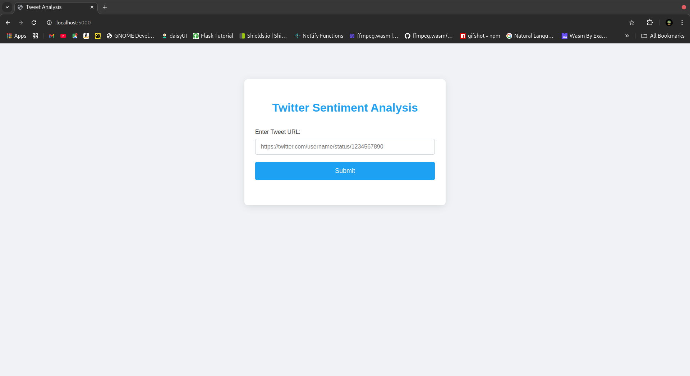
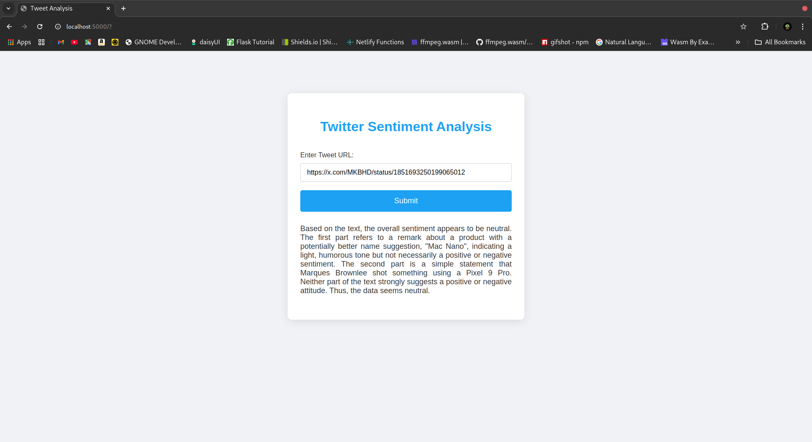

# Tweet Analyzer

## Overview

The Tweet Analyzer is a user-friendly tool that helps you effortlessly understand and interpret tweets from Twitter (also known as X.com). Whether you're curious about the general mood of a user's posts, want to discover the most frequently used words, or need a concise summary of their content, this tool provides quick and accessible insights without the need to read through all the tweets yourself.

## How It Works

Accessing tweets through Twitter's official channels has become expensive (the base price is now $100, or about ₹8,000). To keep our tool free and accessible, we collect tweets using a web scraper, allowing us to gather the necessary data without additional costs while adhering to ethical guidelines.

Once we've collected the tweets, we use advanced AI language processing provided by OpenAI to:

- **Summarize the Tweets**: Offer a concise overview of the main topics and themes discussed, making it easier to understand the user's focus.
- **Determine the Overall Tone**: Assess whether the tweets convey positive, negative, or neutral feelings, helping you gauge the user's sentiment.
- **Analyze Word Frequency**: Identify the most commonly used words to highlight key interests or topics the user frequently mentions.

## Dockerized Deployment

We have containerized the Tweet Analyzer application using Docker to streamline deployment and ensure consistent environments across systems. With Docker, all necessary dependencies are encapsulated in a portable image, allowing for simplified setup and isolated execution.

### Running the Application

To run the application, simply execute the `Makefile` command:

```sh
make
```

This command builds the Docker image, sets up the environment, and runs the application in a Docker container. The `Makefile` handles all setup steps, so you don’t need to worry about manual configuration or dependency installation.

## Features

- **Easy-to-Use Interface**: Navigate through a simple and intuitive design that requires no technical expertise, making it accessible to everyone.
- **Customizable Analysis**: Choose how many tweets to analyze—be it the latest 10 or 100—and select the type of insights you want to receive.
- **Comprehensive Insights**: Get clear summaries, mood assessments, and word frequency lists presented in an easy-to-understand format.
- **Fast Processing**: Receive your analysis in moments, thanks to efficient data handling and AI capabilities.
- **Secure and Private**: We respect user privacy and ensure all data is handled securely and confidentially.

## Why Use Tweet Analyzer?

- **Save Time**: Quickly grasp what a user is talking about without scrolling through endless tweets.
- **Understand Sentiments**: Gain insights into the general mood and tone of a user's posts, which can be valuable for personal understanding or business decisions.
- **Discover Key Topics**: Find out what subjects or themes a user discusses most frequently, useful for market research or staying informed.
- **Cost-Effective**: Avoid expensive services—our tool is free and delivers prompt results without any hidden fees.
- **Enhance Engagement**: If you're a social media manager or marketer, understand your audience or influencers better to improve engagement strategies.

## Getting Started

To begin, simply enter the Twitter handle of the user you're interested in. Select your analysis preferences, such as the number of tweets and the type of insights you want, and let the Tweet Analyzer do the rest. In just moments, you'll receive clear and concise information that helps you understand the user's tweets at a glance.

## Outputs

### Before Analysis


### After Analysis

